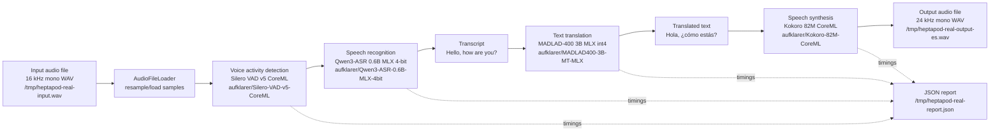
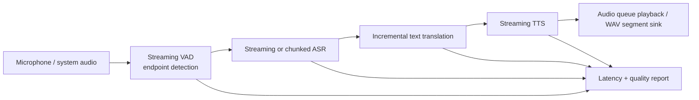

# Real Local Speech Pipeline Schema

This document describes the current runnable local speech-to-speech smoke test.
It is the practical staged path we can optimize toward an OpenAI Realtime
alternative.
The smoke test runs through `HeptapodSpeechToSpeechPipeline` using the concrete
`HeptapodSpeechSwiftAdapters` target.

## Current Flow



## Model Matrix

| Stage | Current model | Runtime | Repo/model ID | Notes |
| --- | --- | --- | --- | --- |
| Audio load | `AudioFileLoader` | AVFoundation | `speech-swift/AudioCommon` | Loads and resamples input to 16 kHz mono samples for ASR. |
| VAD | Silero VAD v5 | CoreML | `aufklarer/Silero-VAD-v5-CoreML` | Gates silent input before ASR. |
| ASR | Qwen3-ASR 0.6B 4-bit | MLX Swift | `aufklarer/Qwen3-ASR-0.6B-MLX-4bit` | Real cached ASR inference is fast enough for segment-based live testing. |
| Translation | MADLAD-400 3B int4 | MLX Swift | `aufklarer/MADLAD400-3B-MT-MLX` | Broad multilingual text translation; large first download. |
| TTS | Kokoro 82M | CoreML path via `speech-swift` | `aufklarer/Kokoro-82M-CoreML` | Good small smoke-test TTS. Turkish phonemizer is not currently supported. |
| Report | `DemoReport` JSON | Foundation | `/tmp/heptapod-real-report.json` | Stores timings, text outputs, audio durations, models, and file paths. |

## Last Cached Smoke Test

Input:

```text
/tmp/heptapod-real-input.wav
0.937s, 16 kHz, mono
```

Output:

```text
/tmp/heptapod-real-output-es.wav
1.250s, 24 kHz, mono
```

Text outputs:

```text
ASR: Hello, how are you?
MT:  Hola, ¿cómo estás?
```

Latency:

| Metric | Seconds |
| --- | ---: |
| VAD model load | 1.618 |
| VAD inference | 0.008 |
| ASR model load | 2.644 |
| ASR inference | 0.138 |
| Translation model load | 2.330 |
| Translation inference | 0.537 |
| TTS model load | 17.393 |
| TTS inference | 0.273 |
| Pipeline inference total | 0.956 |
| Total including model loads | 24.957 |

The important live-latency number is `pipelineInferenceSeconds`: VAD inference +
ASR inference + translation inference + TTS inference. Model load is a
startup/cache-warm cost.

## Run Command

```bash
HF_DOWNLOAD_STALL_TIMEOUT=600 swift run HeptapodRealSpeechDemo -- \
  --audio /tmp/heptapod-real-input.wav \
  --from en \
  --to es \
  --tts-language es \
  --output /tmp/heptapod-real-output-es.wav \
  --report /tmp/heptapod-real-report.json
```

## Live Schema Target

The file smoke test is verified end to end. `HeptapodLiveSpeechDemo --real
--audio` verifies the same live session with deterministic file input, and
`HeptapodLiveSpeechDemo --real --microphone` uses the same core stages with
microphone input and optional AVAudio playback:



The remaining work is app-level polish: permission UX, background audio
behavior, streaming partial-ASR improvements, and production playback
scheduling.

The macOS microphone source has been smoke-tested from the command line. In the
silent local environment it opened input, emitted one segment, and skipped it via
VAD.
